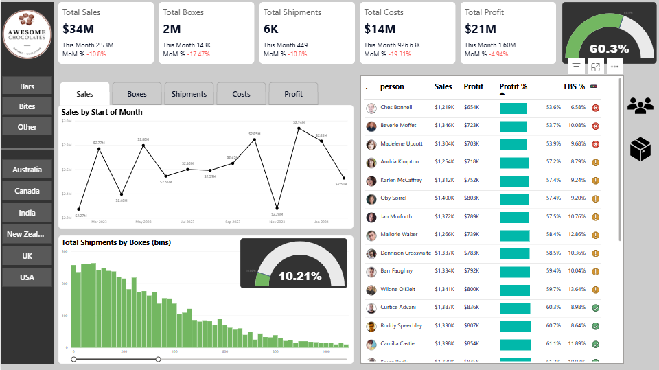

# 🍫 Awesome Chocolate Sales Report

## 📌 Project Overview
The **Awesome Chocolate Sales Report** is an end-to-end data analytics project that analyzes chocolate sales performance using **interactive dashboards and KPIs**.  
The report provides insights into **sales trends, profitability, shipment behavior, product performance, and salesperson efficiency** to support data-driven business decisions.

This project demonstrates practical skills in **Excel, Power BI, Power Query, and DAX**, following a real-world business reporting approach.
See the full dashboard here: [App Power Bi Link](https://app.powerbi.com/view?r=eyJrIjoiMjUwNTkwYjUtY2MyYy00Y2MyLTkyMjctOTcxNGJlMDdlZDk1IiwidCI6ImNkODBjZGZjLTllMjYtNDVlMC1iMTBlLWMwNTYwOGI2ZjZiNiJ9)

---

## 🎯 Business Objectives
- Monitor overall sales and profit performance  
- Track month-over-month (MoM) growth and decline  
- Analyze shipment and box distribution patterns  
- Identify top-performing salespersons  
- Evaluate profitability percentage and cost efficiency  
- Compare performance across products and regions  

---

---

## 📈 Dashboard Features
### 1️⃣ KPI Summary Cards
- Sales, Boxes, Shipments, Costs, Profit  
- Month-over-Month comparison  

### 2️⃣ Sales Trend Analysis
- Sales by start of month (line chart)  
- Identification of peaks and drops  

### 3️⃣ Shipment Distribution
- Total shipments by boxes (binned histogram)  
- Shipment efficiency indicator  

### 4️⃣ Salesperson Performance Table
- Sales, Profit, Profit %  
- LBS % indicator  
- Conditional formatting for quick comparison  

### 5️⃣ Interactive Filters
- Product Type  
- Country / Region  

---

## 🔍 Key Insights
- High overall profitability (**60%+ profit margin**)  
- Noticeable MoM decline in sales volume, but profit impact is limited  
- Certain salespersons consistently outperform others in both sales and profit %  
- Shipment efficiency varies significantly across box ranges  
- Cost reduction helped cushion profit decline  
